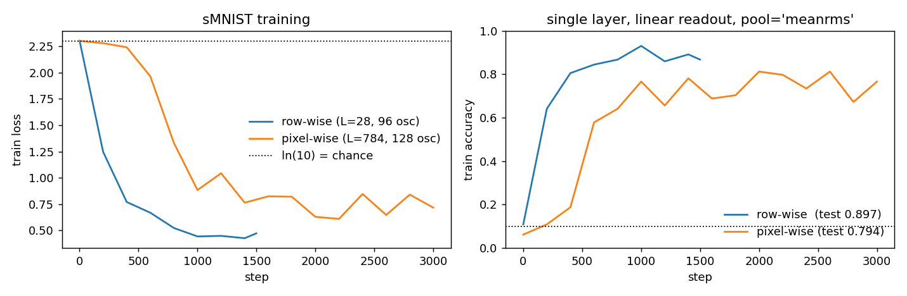
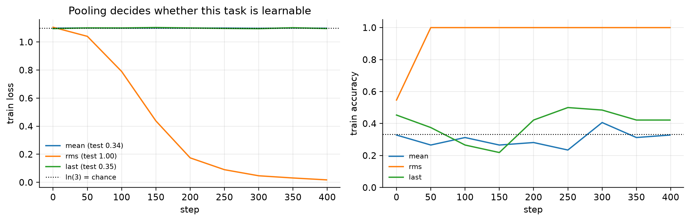
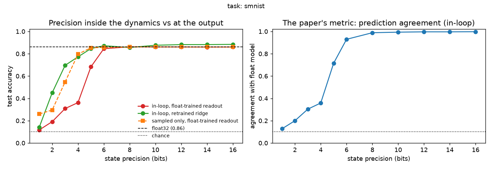

# HORN-JAX.dev

A from-scratch JAX implementation of Harmonic Oscillator Recurrent Networks (HORN).

Written to understand the architecture by building it rather than by reading about it. The
first goal was a correct core, validated against physics. The standing goal is to play with
nested oscillations (bands of frequencies in fixed ratios, with slow phase modulating fast
amplitude) and eventually with spiking readouts.

## What HORN is

**The unit.** A standard RNN unit holds a scalar hidden state pushed around by a sigmoid,
tanh, or a set of learned gates. A HORN unit is instead a damped, driven harmonic oscillator
with a two-dimensional state, position x and velocity ẋ, evolving according to

```math
x'' + 2ζω x' + ω² x = f(x, u)
f(x, u) = W_rec · tanh(x) + W_in · u
```

where ω is the unit's natural frequency and ζ its damping. Units are coupled through a learned
weight matrix, so f mixes the oscillator's own state with input drive and with the states of
every other oscillator in the population.

**Why an oscillator.** In a gated RNN, memory is an engineering artifact: LSTMs need forget
gates because nothing in a tanh unit naturally persists. In an underdamped oscillator,
persistence is built in, because the unit rings. ζ sets how long, so it acts as a tunable
memory horizon; ω sets which input frequencies a unit responds to, so a population with
varied ω is a filter bank.


## Results

Full write-ups, one page per experiment, in [`docs/`](docs/README.md). The headlines:

**Sequential MNIST, single layer, linear readout** ([E03](docs/E03_smnist.md)):

| task | L | usable band | test acc |
|---|---|---|---|
| row-wise | 28 | 3.6–10.0 Hz | **0.897** |
| pixel-wise | 784 | 1.0–78.4 Hz | **0.794** |



**The summary statistic handed to the decoder decides whether a task is learnable at all**
([E02](docs/E02_gain_and_pooling.md)). The readout does not see the response time series; it
sees one number per unit and channel, the "pooling". Frequency discrimination with identical
models, decoded from the time-mean, the final state, or the response power (rms): mean 0.34,
last 0.35, **rms 1.00**. A sinusoidal response time-averages to nearly zero, and the
mean/rms ratio falls with frequency, so decoding from the time-mean discards precisely
the signal from the units working hardest.



**Learned oscillator constants beat a frozen bank** ([E04](docs/E04_frozen_vs_learned.md)):
0.897 vs 0.872 on row-wise sMNIST. More informative than the gap is where the parameters go.
ω migrates down (median 38%) and ζ collapses by an order of magnitude: gradient descent buys
memory by lowering frequency and damping, confirming that ζ's two jobs (gain and memory)
pull in different directions.


**The analog paper's readout collapse, reproduced and dissected**
([E06](docs/E06_readout_precision.md)). The analog HORN paper found its digital readout
agreeing with the hardware on only 28.4% of predictions, recoverable by retraining a linear
readout. Reproduced here on the paper's own task with state precision as the controlled
variable, the computational analogue of an electrode's ADC bit depth, except applied inside
the dynamics: on row-wise sMNIST with the state rounded to n bits at every timestep, the
decoder trained at full precision collapses (agreement 0.13 at 1 bit) while a ridge decoder
refit on the degraded activity recovers, 0.31 to 0.70 at 3 bits. The pattern is the paper's,
collapse plus recovery; the hardware's 28% agreement corresponds to an operating point
somewhere on this curve. Rounding only the observed activity, leaving the dynamics at full
precision, is nearly harmless: the damage is done where the dynamics live.



Running the same protocol on the biphase task inverts an intuition (one seed per task, so
a pattern to test, not a theorem): the phase-coded readout needs 14 bits where sMNIST
needs 6, while its information survives lower precision (ridge recovers 1.000 at 3 bits).
Phase coding protects the information and endangers the mapping; amplitude coding does the
reverse. Any spiking-readout robustness claim (E08) now has a measured baseline to beat
rather than an assumed one.

**Phase is not yet doing the work through training** ([E05](docs/E05_biphase.md)). Every
trained result above is reachable by a filter bank and a power readout. The biphase task
exists to change that: the class is the relative phase of two tones whose power spectrum is
identical by construction. At initialisation the probe shows the sharp result under both
gain conventions: `W_rec = 0` is at chance at every amplitude, while recurrence plus an
engaged nonlinearity reaches 1.00. The first trained grid was an instrument failure worth
reading about ([E00](docs/E00_measure_the_lever.md)): a gain asymmetry left the network
feedforward in all but name, recurrence moved the decoder's class scores by a relative
4e-4, and conditions meant to differ came back bit-identical. Fixed
(`rec_gain="normalised"`, leverage 3.6e-3 to 0.37),
re-run at pilot scale, currently inconclusive; the properly sized grid is the remaining
run.

## Layout

```text
horn/core.py                     dynamics: init_params, step, run_sequence, energy
horn/model.py                    init_net, forward, loss_and_acc, usable_band, freeze_oscillators
horn/tasks.py                    freq_batch (plumbing check), biphase_batch (the real question)
horn/training.py                 train / evaluate, freeze_osc and freeze_rec controls
horn/data.py                     MNIST: IDX parsing, caching, no synthetic fallback
horn/paths.py                    repo-anchored paths, so output never lands in the cwd
experiments/probe_mechanism.py   separability at init: which pooling, which regime
experiments/run_diversity.py     heterogeneous-vs-homogeneous grid on the biphase task
experiments/readout_precision.py quantised state, in-loop vs sampled, readout recovery
tests/test_dynamics.py           5 tests: physics against closed-form solutions
tests/test_model.py              10 tests: shapes, gradients, plumbing, drive balance
tests/test_tasks.py              7 tests: task construction, matched spectra, no label leaks
tests/test_data.py               6 tests: IDX parsing, cache validation, scaling
tests/test_paths.py              4 tests: path anchoring, no import side effects
docs/                            experiment log, one page each: question, result, reproduce
results/                         committed figures and run records
notebooks/01_test_core.ipynb     validation against analytic solutions
notebooks/02_sequence_training.ipynb   readout, the two fixes, training, sMNIST
demo.py                          damping regimes + frequency bank -> results/demo.png
CLAUDE.md                        working context and findings, for whoever picks this up
TESTING.md                       how to run the suite, and what each test is for
```

## Conventions that matter

- **`core.py` works in rad/s; everything user-facing is in Hz**, converted at the boundary.
  Getting this wrong is a factor of 6.28 in every timescale.
- **ω and ζ are stored as logs**, so gradient descent cannot drive them negative. Negative
  damping is exponential blow-up.
- **The readout reads (x, v/ω), not (x, v).** Since v ~ ωx, raw velocity is ~600× position at
  100 Hz and would dominate the readout purely through units.
- **Integration order matters.** Velocity updates first; position uses the *new* velocity.
  Swapping those two lines gives explicit Euler, which injects energy and diverges at ζ=0.

## What I learned

Ordered roughly by how much they changed what I did next.

1. **Amplitude collapse, and the two fixes it forced.** Steady-state response scales as
   `1/(2ζω²)`, so fast units are quiet units. With a flat `W_in` the population produces states
   of order 1e-6, the decoder's class probabilities are uniform, the loss sits at exactly
   `ln(n_classes)`, the value of pure guessing, and gradients are ~1e-4. It looks exactly like a learning-rate problem and is not. Scaling each row of
   `W_in` by `2ζω²` fixes it; `rms` pooling fixes the readout side.

2. **The usable frequency ratio is set by sequence length alone**, at roughly `L/10`. A unit
   must complete at least one cycle within the sequence, and integration needs ~10 samples per
   period; those two constraints leave a ratio of `L/(min_cycles × steps_per_period)`. Row-wise
   MNIST (28 steps, ratio 2.8) therefore *cannot* represent a 1:6 nesting, whatever else is done
   to it. This ruled out a task before I wasted a week on it.

3. **ζ sets memory in cycles; ω sets it in seconds.** The envelope time constant is `1/(ζω)`,
   but measured in *cycles* it is `1/(2πζ)` and depends on ζ alone. That is awkward, because ζ
   is simultaneously the amplitude-normalisation knob: one parameter with two jobs that pull
   in different directions. E04 shows trained networks resolving the conflict in favour of
   memory.

4. **The falsifying control is the architecture, not the pooling.** Going into the biphase
   probe, the prediction was that `rms` pooling would be the control that stays at chance. It
   is not: once the tanh is engaged the network converts biphase into internal power and rms
   climbs to 0.65. What stays at chance at every amplitude is `W_rec = 0`. A bank of
   independent resonators cannot form the product that carries the label, which is the claim
   the whole experiment rests on, confirmed before training.

5. **A slow filter is a narrow one.** A sweeping input dwells in a unit's resonance peak for a
   time ∝ ζω while the unit needs `1/(ζω)` to fill, so the fraction of steady state reached
   goes as `(ζω)²`. Slow, lightly damped units never catch up. This is the time-frequency
   uncertainty principle appearing inside a network layer, and it constrains what any fixed
   oscillator bank can do on short sequences.

6. **Measure the lever before pulling it.** A sweep whose independent variable moves the
   output by 4e-4 is not a null result, it is a broken instrument, and its table looks
   exactly like ordinary results. The check costs one forward pass per variable.
   [E00](docs/E00_measure_the_lever.md) is this lesson written out; it has already caught
   three separate one-line bugs in this repo.

## Limitations

- **The sMNIST numbers are baselines, not comparisons.** One small single-layer model, default
  settings, no stacking, no tuning. They exist to anchor the repo's own ablations, not
  to be placed next to published HORN results.
- **The phase claim is supported at initialisation, not yet through training.** The biphase
  probe shows the mechanism exists in an untrained network, under both gain conventions. The
  trained grid has only run at pilot scale, and its first version was invalidated by
  the rec-gain bug (E00); a properly sized run with a conditioned readout is still owed.
- **Single layer only.** No claim here bears on depth.
- **No comparison against `brainmass`.** Independent implementation validated against physics,
  not against the reference.

## Reproducing

```bash
git clone <this repo> && cd horn-jax
uv venv --python 3.12 && source .venv/bin/activate

uv pip install -e ".[dev,notebooks]"        # CPU
# uv pip install -e ".[cuda,dev,notebooks]" # NVIDIA GPU
pytest                                      # 32 passed. Also see TESTING.md
python demo.py                              # writes results/demo.png
jupyter lab notebooks/                      # 01 then 02
```

MNIST downloads on first use and caches to `data/mnist.npz`.

## Open

- [x] Core dynamics, validated against analytic solutions
- [x] Sequence layer, linear readout, training loop
- [x] Frequency discrimination trained to ceiling
- [x] Sequential MNIST, row-wise and pixel-wise
- [x] Frozen vs learned (ω, ζ)
- [x] Readout precision: the analog paper's readout collapse, reproduced and dissected on
      biphase and on sMNIST, the paper's own task
- [ ] Biphase: properly sized trained grid (the smoke-scale run is recorded but
      inconclusive; see E05)
- [ ] Stacked layers
- [ ] Nested banded ω with cross-frequency modulation vs flat heterogeneity, matched parameters
- [ ] Spiking readout: does phase coding degrade more gracefully than a continuous readout?
      E06 is the baseline to beat

## References

- Effenberger et al., *An analog-electronic implementation of a harmonic oscillator recurrent
  network*, [arXiv:2509.04064](https://arxiv.org/abs/2509.04064)
- Effenberger, Carvalho, Dubinin & Singer, *The functional role of oscillatory dynamics in
  neocortical circuits: A computational perspective*, PNAS 2025
  ([link](https://www.pnas.org/doi/10.1073/pnas.2412830122))
- Reference implementation: [`brainmass`](https://brainmass.readthedocs.io/reference/horn.html)
