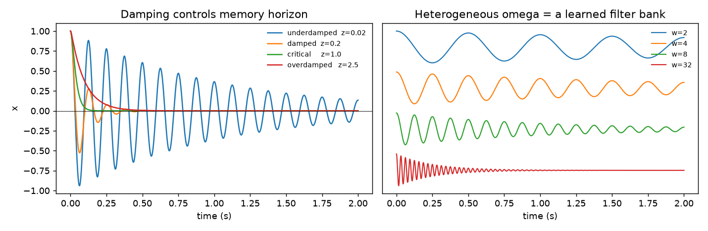

# E01: Core validation against closed-form physics

**Question.** Does an isolated, undriven unit reproduce the damped harmonic oscillator it
is supposed to be? Not "does the code run", but does it match the analytic solution.

**Method.** An uncoupled HORN unit has an exact solution, so the tests compare
trajectories against ground truth rather than against the code's own output: free decay,
energy conservation as ζ approaches zero (which separates semi-implicit from explicit
Euler), overdamped decay without a zero crossing, spectral independence of units with
different natural frequencies, and gradient flow through the full unrolled sequence.
Notebook 01 adds impulse response, steady-state amplitude and phase against a swept
drive, and convergence under refinement of the timestep.

**Result.** All pass. `results/pytest.txt` holds the committed run.



Left: ζ sets the memory horizon, from ringing at low damping to a slow crawl above
critical. Right: uncoupled units retain their own natural frequencies, verified by FFT.
That independence is the precondition for treating a heterogeneous population as a filter
bank, and for anything nested built on top of it.

**Reproduce.**

```bash
pytest tests/test_dynamics.py
python demo.py                  # writes results/demo.png
jupyter lab notebooks/01_test_core.ipynb
```
