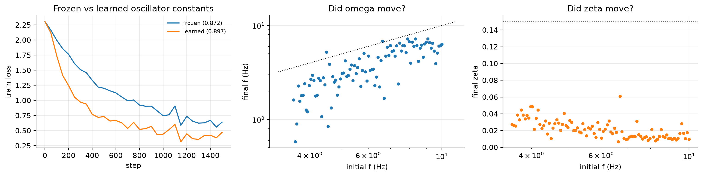

# E04: Frozen versus learned oscillator constants

**Question.** Do fitted natural frequencies and damping ratios beat a fixed,
well-initialised bank, and if so, where do they move?

**Setup.** Row-wise sMNIST as in E03. Two conditions identical except that one zeroes the
gradient on `log_omega` and `log_zeta` (`freeze_oscillators`), holding the bank at its
initialisation while everything else is fitted.

**Result.**

| condition | test acc |
|---|---|
| frozen ω, ζ | 0.8715 |
| fitted ω, ζ | **0.8971** |

The 0.026 difference is small. Where the bank moves is the substantive part:

- **Natural frequencies migrate down.** 3.57-10.0 Hz at initialisation to 0.58-7.23 Hz
  after fitting; median |Δf|/f = 38%, maximum 84%. The task calls for slower units than
  the usable-band heuristic supplies.
- **Damping collapses by an order of magnitude**, 0.15 to 0.007-0.061.

Both movements buy the same thing, a longer memory horizon, and they arrive at it by
lowering frequency and letting units ring longer. This is the parameterisation conflict
noted in the findings, seen from the other side: ζ sets memory in cycles and simultaneously
normalises amplitude, and when both are free the fit sacrifices the normalisation.

**Reproduce.** Notebook 02 §8, or `horn.training.train(freeze_osc=True/False)` on the
row-wise task.
