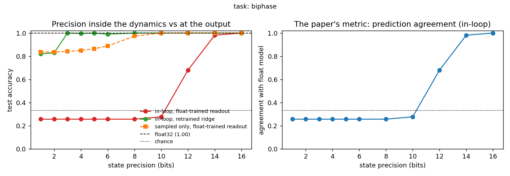

# E06: Readout precision, the analog paper's failure mode in simulation

**Question.** arXiv:2509.04064 transferred a trained HORN to analog hardware: the dynamics
matched their digital twin, yet the digital readout agreed with it on only 28.4% of
predictions, and retraining a linear readout on the analog dynamics recovered full
performance. Can that failure mode be reproduced and dissected in simulation, with
precision as the controlled variable?

**Method.** Train a HORN plus affine readout at float32 on the biphase task (the
phase-coded task from E05, so the information at stake is the delicate kind). Then re-run
inference under two precision regimes, sweeping bit depth:

- **in-loop**: the state (x, v) is quantised inside the recurrent loop at every step,
  which is how an analog substrate actually evolves;
- **sampled**: the float dynamics are quantised only at observation, an ADC at the output.

Per bit depth, report the float-trained readout's accuracy, the accuracy of a ridge
readout retrained on the degraded features, and the fraction of predictions agreeing with
the float model (the paper's metric).

**Result.** Float32 test accuracy 1.000, chance 0.333.

| bits | in-loop, orig | in-loop, ridge | agreement | sampled, orig |
|---|---|---|---|---|
| 1 | 0.258 | 0.820 | 0.258 | 0.836 |
| 3 | 0.258 | 1.000 | 0.258 | 0.842 |
| 6 | 0.258 | 0.990 | 0.258 | 0.889 |
| 10 | 0.278 | 1.000 | 0.278 | 1.000 |
| 12 | 0.680 | 1.000 | 0.680 | 1.000 |
| 14 | 0.982 | 1.000 | 0.982 | 1.000 |
| 16 | 1.000 | 1.000 | 1.000 | 1.000 |



Three separate facts, one figure:

1. **The information survives to 3 bits.** A retrained linear readout classifies
   perfectly on dynamics evolving at 3-bit state precision, and reaches 0.82 at 1 bit.
2. **The float-trained readout collapses below 14 bits**, bottoming out near the paper's
   28% agreement. The mapping is fragile, not the information, which is the paper's
   hardware finding reproduced end to end.
3. **The damage is done inside the loop, not at the output.** Quantising only the
   observation barely hurts even at 1 bit, because pooling over 400 steps averages
   observation noise away. Precision matters where the dynamics live.

The gap between in-loop collapse (14 bits) and information survival (3 bits) is the
opportunity the analog program exploits: a readout adapted to the substrate is worth
roughly 11 bits of state precision on this task.

**Caveat.** One task, one seed, one architecture size. The sMNIST variant
(`--task smnist`) runs the same protocol on the task the paper used and has not been run
yet; the biphase result is the committed one because it needs no data download.

**Reproduce.**

```bash
python experiments/readout_precision.py            # biphase, CPU, ~3 min
python experiments/readout_precision.py --task smnist
```
