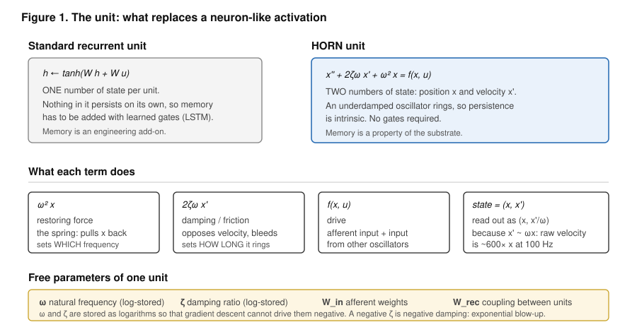
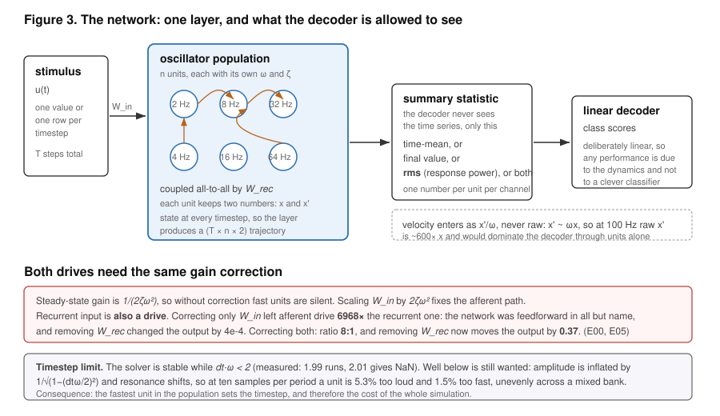
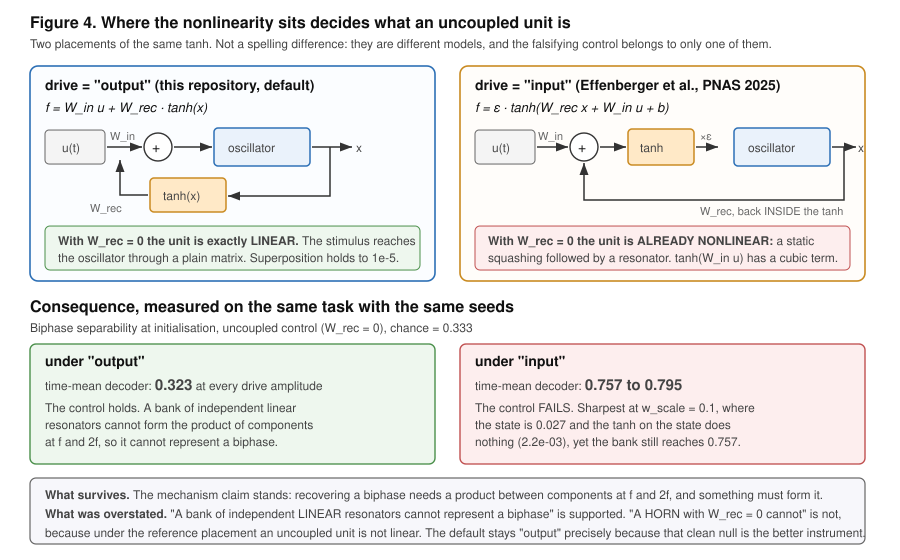
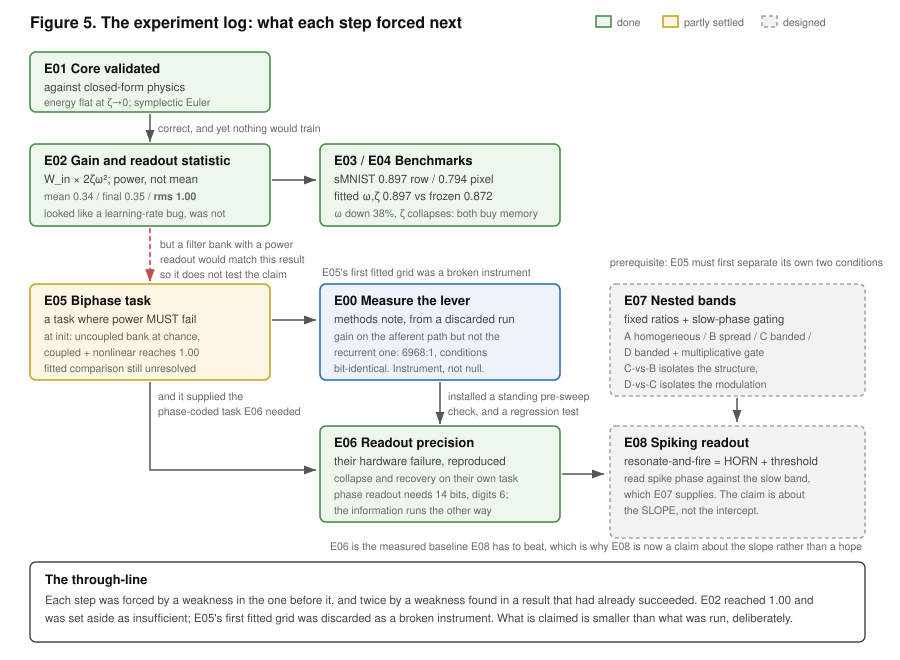
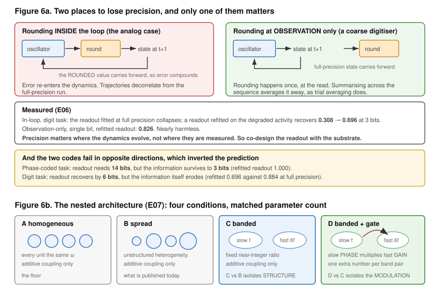

# Diagrams

Six figures summarising the project: what a unit is, how it is tuned, how the network is
assembled, the one modelling choice that changes the conclusions, how the experiments
depend on each other, and the two results that point forward.

Figures 1 and 3 to 6 are drawn (SVG, editable as text). Figure 2 is generated from the
dynamics themselves, so its curves are measurements rather than illustrations.

---

## 1. The unit



A standard recurrent unit holds one number and needs learned gates before anything
persists. A HORN unit holds two, position and velocity, and persists because an
underdamped oscillator rings. The panel also names the four free parameters and why ω and
ζ are stored as logarithms.

---

## 2. Tuning: what ω and ζ actually control


Generated by `docs/figures/make_fig2.py` from the same code the experiments use.

- **(a)** ζ sets how long a unit rings, from a long ringing tail at 0.02 to a sluggish
  crawl above critical damping.
- **(b)** ω sets which drive frequency a unit answers to, and shows the amplitude problem
  directly: the resonant peak falls as 1/(2ζω²), so fast units are quiet units. This is
  why a mixed population is scale-mismatched at the decoder before any fitting happens.
- **(c)** The two memory horizons. In seconds the horizon is 1/(ζω), so it depends on both
  parameters; in cycles it is 1/(2πζ) and depends on ζ alone. ζ therefore sets memory and
  normalises amplitude at the same time, which is one parameter with two jobs. E04 shows
  the fitting resolving that conflict in favour of memory.

---

## 3. The network



Stimulus, coupled population, summary statistic, linear decoder. Two constraints are
attached because they caused real failures: both the afferent and the recurrent drive need
the same gain correction (correcting only one left the network feedforward in all but
name), and the fastest unit in the population sets the timestep for everyone.

---

## 4. Where the nonlinearity sits



The single most consequential modelling choice in the repository. Putting the tanh on the
output path (this repo) or on the input path (the reference model) decides what an
*uncoupled* unit is: a linear filter in the first case, an already-nonlinear element in the
second. Measured on the same task with the same seeds, the falsifying control holds under
one placement and fails under the other. The figure states what survives that
qualification and what was overstated.

---

## 5. How the experiments depend on each other



The dependency graph of E00 to E08, colour-coded by status. The two dashed red arrows are
the informative ones: each marks a point where a result that had already succeeded was set
aside, once because a filter bank would have matched it and once because the instrument
was broken.

---

## 6. The two results that point forward



**6a** separates rounding inside the dynamics from rounding at the observation, and shows
that only the first matters. It also shows the inversion: the phase-coded task needs more
precision for its decoder yet keeps its information at lower precision than the digit
task, which is the opposite of the prediction that motivated E08.

**6b** lays out the four nested-band conditions at matched parameter count, with the
two comparisons that make a positive result interpretable rather than a horse race.

---

## Regenerating

Figure 2 is the only computed one:

```bash
python docs/figures/make_fig2.py     # writes docs/figures/fig2_tuning.png
```

The SVGs are hand-written and edited as text. They contain no external references.